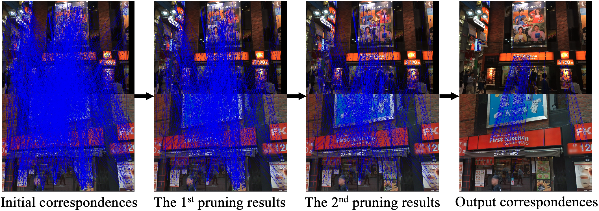

<div align=center>
    <h1>NCMNet: Neighbor Consistency Mining Network </br>  for Two-View Correspondence Pruning</h1>

[**Xin Liu**](https://xinliu29.github.io/),
[**Rong Qin**](https://qinrong-nku.github.io/),
[**Wentao Cheng**](https://thinklab.sjtu.edu.cn/),
[**Jufeng Yang**](https://cv.nankai.edu.cn/)

**[TPAMI 2024] **

<a href="https://xinliu29.github.io/papers/NCMNet+/TPAMI_liuxin_NCMNet.pdf"></a>
<a href="https://xinliu29.github.io/papers/NCMNet+/TPAMI_NCMNet_CV.pdf"></a>
<a href='https://github.com/xinliu29/NCMNet'></a>	

[ [Paper](https://xinliu29.github.io/papers/NCMNet+/TPAMI_liuxin_NCMNet.pdf) ]
[ [中译版](https://xinliu29.github.io/papers/NCMNet+/TPAMI_NCMNet_CV.pdf) ]
[ [Code](https://github.com/xinliu29/NCMNet) ]

</div>

<div align=center>
    <h1>Progressive Neighbor Consistency Mining </br> for Correspondence Pruning</h1>

[**Xin Liu**](https://xinliu29.github.io/),
[**Jufeng Yang**](https://cv.nankai.edu.cn/)

**[CVPR 2023](https://openaccess.thecvf.com/content/CVPR2023/html/Liu_Progressive_Neighbor_Consistency_Mining_for_Correspondence_Pruning_CVPR_2023_paper.html) **

[ [Paper](https://xinliu29.github.io/papers/NCMNet/Liu_Progressive_Neighbor_Consistency_Mining_for_Correspondence_Pruning_CVPR_2023_paper.pdf) ]
[ [Code](https://github.com/xinliu29/NCMNet) ]

</div>


## Abstract


Correspondence pruning plays a crucial role in a variety of feature matching based tasks, which aims at identifying correct correspondences (inliers) from initial ones. Seeking consistent $k$-nearest neighbors in both coordinate and feature spaces is a prevalent strategy employed in previous approaches. However, the vicinity of an inlier contains numerous irregular false correspondences (outliers), which leads them to mistakenly become neighbors according to the similarity constraint of nearest neighbors. To tackle this issue, we propose a global-graph space to seek consistent neighbors with similar graph structures. This is achieved by using a global connected graph to explicitly render the affinity relationship between correspondences based on the spatial and feature consistency. Furthermore, to enhance the robustness of method for various matching scenes, we develop a neighbor consistency block to adequately leverage the potential of three types of neighbors. The consistency can be progressively mined by sequentially extracting intra-neighbor context and exploring inter-neighbor interactions. Ultimately, we present a Neighbor Consistency Mining Network (NCMNet) to estimate the parametric models and remove outliers. Extensive experimental results demonstrate that the proposed method outperforms other state-of-the-art methods on various benchmarks for two-view geometry estimation. Meanwhile, four extended tasks, including remote sensing image registration, point cloud registration, 3D reconstruction, and visual localization, are conducted to test the generalization ability.


# NCMNet Pipeline
Framework of our NCMNet. $N\times 4$ initial correspondences are established as inputs, then, the parametric model and $N\times 1$ inlier probabilities are estimated. The iterative pruning strategy containing two pruning modules is adopted as the core architecture to distill more reliable candidates for model estimation. Each pruning module includes several existing network structures and the proposed Neighbor Consistency (NC) block. NC block mainly consists of three key parts: the construction of three neighbor embeddings ($\mathcal{G}^S, \mathcal{G}^F, \mathcal{G}^G$), Self-Context Extraction (SCE) layer to capture and aggregate intra-neighbor context ($C^S, C^F, C^G$), and Cross-Context Interaction (CCI) layer to fuse and modulate inter-neighbor information ($I^S, I^F, I^G$). CS: the coordinate space, FS: the feature space, GS: the global-graph space.
<p align="center">
  
</p>
 <br/>

## Requirements

Please use Python 3.6, opencv-contrib-python (3.4.0.12) and Pytorch (>= 1.1.0). Other dependencies should be easily installed through pip or conda.


# Preparing Data
Please follow their instructions to download the training and testing data.
```bash
bash download_data.sh raw_data raw_data_yfcc.tar.gz 0 8 ## YFCC100M
tar -xvf raw_data_yfcc.tar.gz

bash download_data.sh raw_sun3d_test raw_sun3d_test.tar.gz 0 2 ## SUN3D
tar -xvf raw_sun3d_test.tar.gz
bash download_data.sh raw_sun3d_train raw_sun3d_train.tar.gz 0 63
tar -xvf raw_sun3d_train.tar.gz
```
 
After downloading the datasets, the initial matches for YFCC100M and SUN3D can be generated as following. Here we provide descriptors for SIFT (default), ORB, and SuperPoint.
```bash
cd dump_match
python extract_feature.py
python yfcc.py
python extract_feature.py --input_path=../raw_data/sun3d_test
python sun3d.py
```

# Testing and Training Model
We provide a pretrained model on YFCC100M. The results in our paper can be reproduced by running the test script:
```bash
cd code 
python main.py --run_mode=test --model_path=../model/yfcc --res_path=../model/yfcc 
```
Set `--use_ransac=True` to get results after RANSAC post-processing.

If you want to retrain the model on YFCC100M, run the tranining script.
```bash
cd code 
python main.py 
```

You can also retrain the model on SUN3D by modifying related settings in `code\config.py`.

# Demo
We provide a fast running demo. You can also use any two images to generate the initial correspondences and pruning results. Please note the distinction between our conference and journal models.

```bash
cd demo 
python demo.py 
```
We also give an example for the pruning results of NCMNet+.

<p align="center">
  
</p>
 <br/>

# Citing NCMNet
If you find the NCMNet code useful, please consider citing:
```bibtex
@article{liu2024ncmnet,
  title={NCMNet: Neighbor Consistency Mining Network for Two-View Correspondence Pruning},
  author={Liu, Xin and Qin, Rong and Yan, Junchi and Yang, Jufeng},
  journal={IEEE Transactions on Pattern Analysis and Machine Intelligence},
  number={},
  pages={1--19},
  year={2024},
  publisher={IEEE}
}
```
```bibtex
@inproceedings{liu2023ncmnet,
  author    = {Liu, Xin and Yang, Jufeng},
  title     = {Progressive Neighbor Consistency Mining for Correspondence Pruning},
  booktitle = {Proceedings of the IEEE/CVF Conference on Computer Vision and Pattern Recognition (CVPR)},
  month     = {June},
  year      = {2023},
  pages     = {9527-9537}
}
```

# Acknowledgement
This code is borrowed from [[OANet](https://github.com/zjhthu/OANet)] [[CLNet](https://github.com/sailor-z/CLNet)]. If you use the part of code related to data generation, testing, or evaluation, you should cite these papers:
```bibtex
@inproceedings{zhang2019oanet,
  title={Learning Two-View Correspondences and Geometry Using Order-Aware Network},
  author={Zhang, Jiahui and Sun, Dawei and Luo, Zixin and Yao, Anbang and Zhou, Lei and Shen, Tianwei and Chen, Yurong and Quan, Long and Liao, Hongen},
  journal={Proceedings of the IEEE/CVF International Conference on Computer Vision},
  year={2019}
}
@inproceedings{zhao2021clnet,
  title={Progressive Correspondence Pruning by Consensus Learning},
  author={Zhao, Chen and Ge, Yixiao and Zhu, Feng and Zhao, Rui and Li, Hongsheng and Salzmann, Mathieu},
  booktitle={Proceedings of the IEEE/CVF International Conference on Computer Vision},
  year={2021}
}
```  
